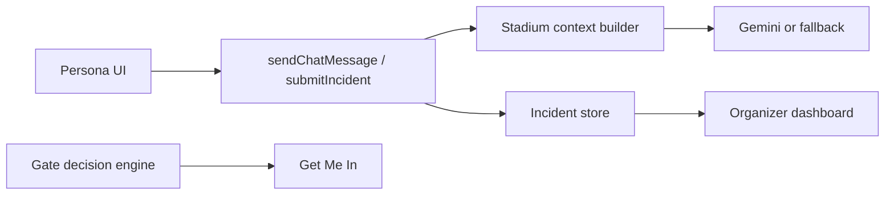

# StadiumIQ-AI

**Unofficial concept demo** — AI-powered stadium intelligence for FIFA World Cup 2026 match days.

Helps fans pick the best entrance, supports accessible routing, guides emergencies, and connects volunteer incident reports to organizer operations.

> Not affiliated with FIFA. Built as a challenge submission demonstrating a smart, context-aware assistant.

## Chosen Vertical

**Stadium / large-event operations intelligence** for three personas:

| Persona | Primary job-to-be-done |
|---------|------------------------|
| Fan | Get into the venue fast (optionally via an accessible gate) |
| Volunteer | Report incidents that ops can act on |
| Organizer | See live crowd pressure + incident queue + AI briefing |

## Approach & Logic

1. **Deterministic decision engine first** — `recommendBestGate()` scores open gates by wait time, congestion, and accessibility constraints.
2. **AI second, with stadium context** — Chat/emergency/accessibility/organizer calls go through a **server action** that injects allowlisted context (gates, weather, help centers, role, accessibility needs).
3. **Graceful offline demo** — Without `GEMINI_API_KEY`, the server returns useful fallback guidance grounded in the same stadium snapshot (no broken UI).
4. **Honest demo auth** — Header role switcher (fan / volunteer / organizer) for judges; not production RBAC.



## How the Solution Works

### Fan path (high impact)

1. Open `/` → **Get Me In — Best Gate Now**
2. Toggle accessible entrance if needed
3. Follow the recommended gate / ask AI Chat for directions
4. Use Stadium Map + Emergency panel for in-venue help

### Volunteer → Organizer loop

1. Switch role to **Volunteer** → Report Incident
2. Switch role to **Organizer** → new report appears in Active Incidents
3. Refresh AI operations summary for a briefing that includes stadium context

### AI path (secure)

- UI → `askStadiumAI` → `sendChatMessage` (server only)
- `POST /api/ai/generate` is **disabled** (no raw-prompt proxy)
- Rate limiting + Zod validation + context allowlisting

## Demo vs Production

| Capability | Demo (default) | Production seam |
|------------|----------------|-----------------|
| Gate / crowd data | Simulated MetLife Stadium with time wobble | Replace `stadium/data.ts` with live feeds / Firestore |
| AI answers | Gemini if key set, else stadium-aware fallback | Same server path |
| Auth / roles | localStorage demo switcher | Firebase Auth + server token verify |
| Maps | CSS stadium map | Optional Google Maps key |
| Incidents | Process-local store | Firestore + notifications |
| Rate limits | In-memory per instance | Redis / Vercel KV |

## 3-Minute Judge Script

1. `npm install && npm run dev` → open `http://localhost:3000`
2. Use **Get Me In**; toggle accessible entrance
3. Open **AI Chat**, ask: “Which gate should I use with a wheelchair?”
4. Switch role → **Volunteer**, submit an incident
5. Switch role → **Organizer**, confirm the incident and AI summary
6. Optional: set `GEMINI_API_KEY` in `.env.local` and repeat chat

## Tech Stack

- Next.js 15 (App Router) · TypeScript · Tailwind · Radix UI
- Google Gemini (`@google/generative-ai`) — optional
- Zod · Vitest · Playwright · axe-core
- Vercel-ready

## Getting Started

### Prerequisites

- Node.js 20+
- npm 10+

### Installation

```bash
git clone https://github.com/neelamchawla/StadiumIQ-AI.git
cd StadiumIQ-AI
npm install
cp .env.example .env.local
npm run dev
```

### Environment Variables

| Variable | Required | Description |
|----------|----------|-------------|
| `GEMINI_API_KEY` | No | Enables live Gemini; otherwise deterministic fallbacks |
| `AI_MODEL` | No | Default `gemini-2.0-flash` |
| `AI_RATE_LIMIT_PER_MINUTE` | No | Default `30` |
| `NEXT_PUBLIC_FIREBASE_*` | No | Optional production auth/data |
| `NEXT_PUBLIC_GOOGLE_MAPS_API_KEY` | No | Optional Maps integration |

## API Routes

| Method | Endpoint | Description |
|--------|----------|-------------|
| `GET` | `/api/health` | Public health (`ok` + version only) |
| `GET` | `/api/gates` | Gate statuses |
| `GET` | `/api/gates/recommend?accessible=1` | Best-gate recommendation |
| `GET` | `/api/crowd` | Crowd predictions |
| `POST` | `/api/ai/chat` | Validated, rate-limited AI chat |
| `POST` | `/api/ai/generate` | Disabled (`410`) |

## Testing & Quality

```bash
npm run typecheck
npm run lint
npm test
npx playwright install chromium
npm run test:e2e
```

CI: `.github/workflows/ci.yml` (typecheck, lint, unit, e2e).

See [docs/TESTING.md](docs/TESTING.md), [docs/SECURITY.md](docs/SECURITY.md), [docs/ACCESSIBILITY.md](docs/ACCESSIBILITY.md), [docs/ARCHITECTURE.md](docs/ARCHITECTURE.md).

## Assumptions

- Single venue mock: MetLife Stadium
- “Live” data is simulated with mild minute-bucket variation
- Emergency AI provides guidance, not a substitute for calling staff / emergency services
- Demo roles are for evaluation UX, not authorization
- Multilingual preference is passed to the AI; full RTL layout is not complete
- Repository stays on a single `main` branch for submission rules

## License

Concept demo for evaluation — © 2026 StadiumIQ-AI contributors. FIFA marks used only for contextual World Cup scenario framing; no affiliation claimed.
